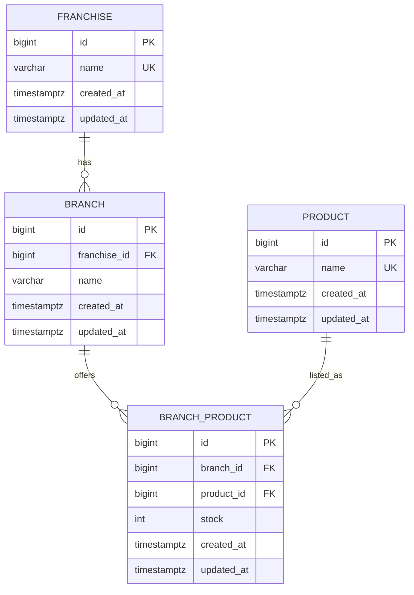

# accenture-backend
API REST desarrollada en Spring Boot para gestionar franquicias, sucursales y productos con control de stock. Permite crear, actualizar y eliminar entidades, además de consultar el producto con mayor inventario por sucursal dentro de una franquicia. Incluye persistencia de datos y soporte para despliegue con Docker.

